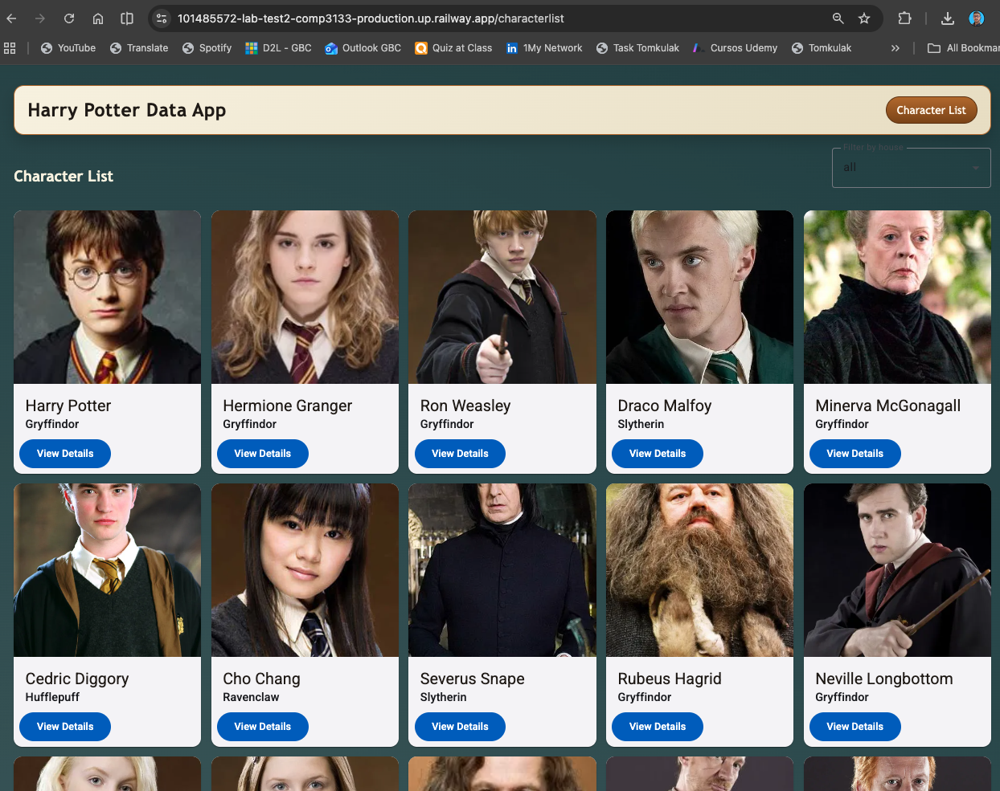
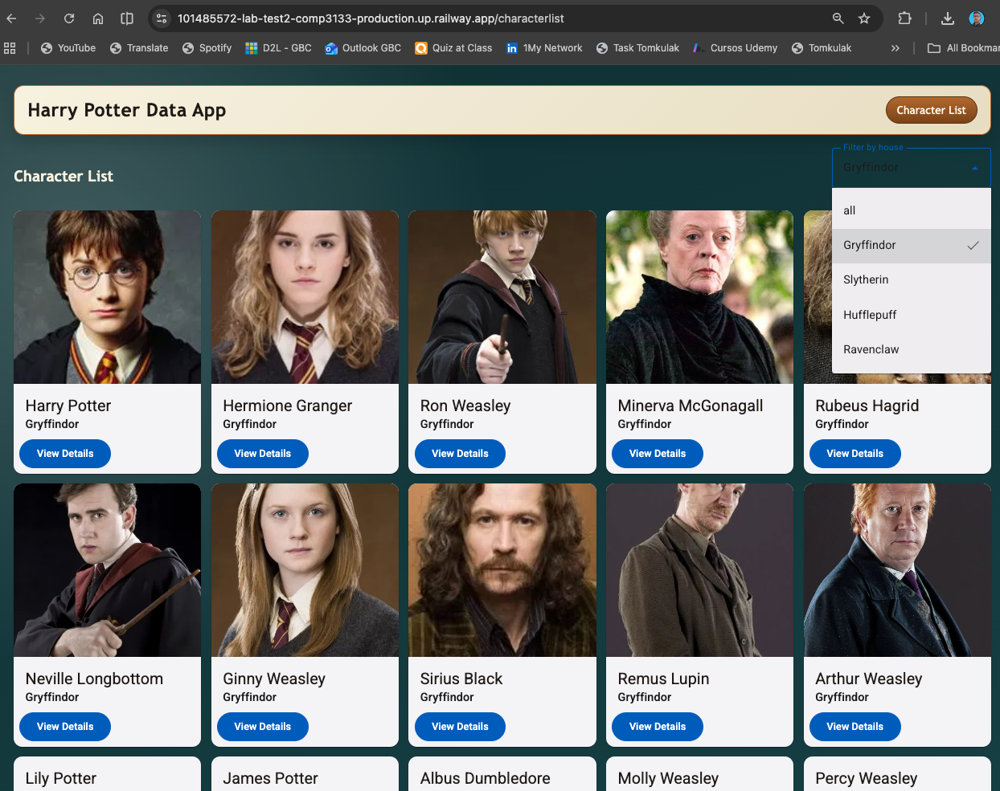
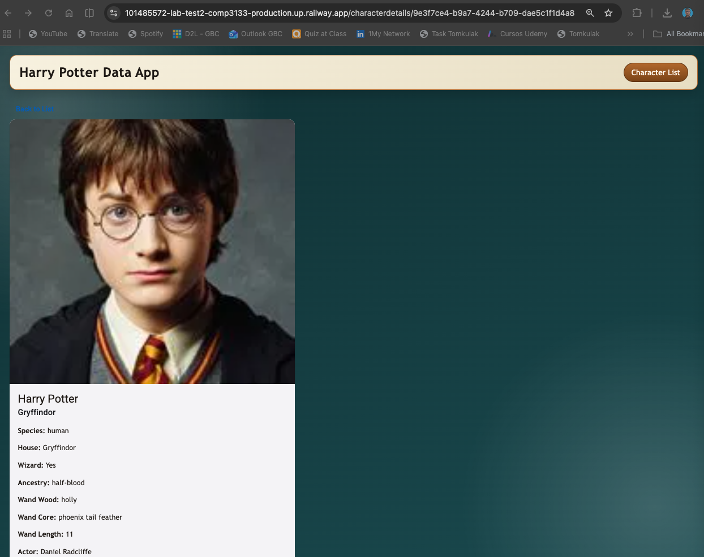

# Test Version 2b - Harry Potter Theme

## Student Information
- Name: Breno Lopes Mafra
- ID: 101485572

## App Description
This Angular app fetches and displays Harry Potter related data from public APIs.
The project includes character and house data screens, search and filter controls,
and Angular modern template syntax.

## Features Implemented
- Angular latest project setup
- HTTP data fetching with `HttpClientModule`
- `FormsModule` and `ReactiveFormsModule` usage
- Service layer for API calls
- TypeScript interfaces/models
- Components required by assignment:
	- `characterlist`
	- `characterfilter`
	- `characterdetails`
- Search/filter by house in dropdown
- Angular template features:
	- `@for`
	- `@if`
	- `signal`
- Angular Material UI components
- Basic custom styling

## API Sources
- Characters: `https://hp-api.onrender.com/api/characters`
- Character by house: `https://hp-api.onrender.com/api/characters/house/:house`
- Character details: `https://hp-api.onrender.com/api/character/:id`

## Screenshots
Add these screenshots before final submission.

### 1) All Characters Screen
Description: capture the main screen showing all characters with search/filter controls.



### 2) Characters from a specific house
Description: capture the screen showing characters filtered by a specific house.



### 3) Character details screen
Description: capture the screen showing details of a specific character.



## How to Run the Project
1. Install dependencies:

```bash
npm install
```

2. Start development server:

```bash
npm start
```

3. Open in browser:

```text
http://localhost:4200/
```

## Build Command
```bash
npm run build
```

## Submission Notes
- GitHub repository link: https://github.com/BrenoMafra13/101485572-lab-test2-comp3133
- Deployment link: https://101485572-lab-test2-comp3133-production.up.railway.app/
